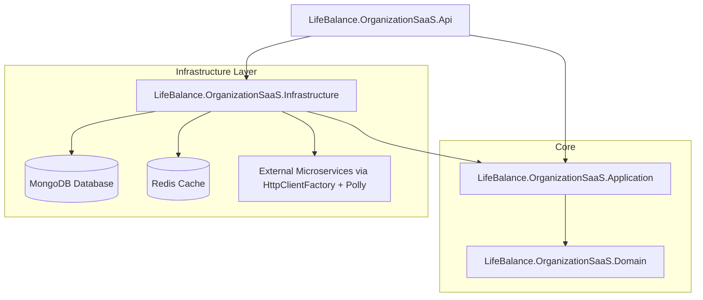

# LifeBalance - Organization & SaaS Service Microservice


The **Organization & SaaS Service** is the enterprise core microservice of the **LifeBalance** platform. It manages multi-tenant organizational structures (Companies, Families, Departments, Teams), SaaS subscriptions, plan tier limits, licenses, memberships, invitations, and compliance auditing.

---

## 🏛 Architecture & Design Patterns

The microservice strictly enforces **Clean Architecture**, **Domain-Driven Design (DDD)**, and **CQRS (Command Query Responsibility Segregation)**:



### Layer Breakdown
- `LifeBalance.OrganizationSaaS.Domain`: Aggregate Roots, Entities (`Organization`, `Family`, `Department`, `Team`, `License`, `Subscription`, `Invitation`, `AuditLog`), Value Objects, Domain Enums, Domain Exceptions, and Repository Interfaces. Zero framework dependencies.
- `LifeBalance.OrganizationSaaS.Application`: CQRS Handlers (MediatR), DTOs, FluentValidation rules, Pipeline Behaviors (Logging, MultiTenant Validation, Request Validation), and Microservice Interfaces.
- `LifeBalance.OrganizationSaaS.Infrastructure`: MongoDB Context and generic `MongoRepository<T>` with automatic Tenant filter injection, Typed HTTP Clients with **Polly** resilience policies (Retry, Circuit Breaker), Distributed Caching, and Tenant Accessor.
- `LifeBalance.OrganizationSaaS.Api`: RESTful API Controllers v1, Security Headers Middleware, Correlation ID Middleware, Rate Limiting, Exception Handling (ProblemDetails RFC 7807), and Swagger/OpenAPI.

---

## 🏢 Multi-Tenant Model & Security

Isolation is enforced at the persistence layer using a mandatory `TenantId` attribute. Every database operation automatically appends the current `TenantId` to query filters, preventing cross-tenant data leakage (IDOR / Broken Access Control protection).

### Context Resolution Sequence:
1. `X-Tenant-Id` header (HTTP Request).
2. JWT `tenant_id` claim.
3. Strict validation: If an authenticated user attempts to request data outside their assigned `TenantId`, a `403 Forbidden` response is returned.

---

## 💎 SaaS Plans Matrix

| Feature / Limit | Free | Personal | Family | Business | Enterprise |
| :--- | :---: | :---: | :---: | :---: | :---: |
| **Max Users** | 5 | 1 | 6 | 250 | 10,000+ |
| **Max Families** | 1 | 0 | 1 | 0 | 500 |
| **Max Companies** | 1 | 0 | 0 | 1 | 50 |
| **Max Departments** | 2 | 0 | 0 | 20 | 200 |
| **Max Teams** | 2 | 0 | 0 | 50 | 1,000 |
| **Data Retention** | 30 days | 90 days | 180 days | 365 days | Custom |
| **Dashboards & Reports** | Basic | Basic | Family | Full | Custom |
| **AI Insights & Gamification** | ❌ | ❌ | ✅ | ✅ | ✅ |
| **API Access** | ❌ | ❌ | ❌ | ✅ | ✅ |

---

## 🔄 Microservices Communication Matrix

The **Organization & SaaS Service** communicates with sibling microservices via resilient HTTP Clients (`HttpClientFactory` + Polly):

| Target Microservice | Direction | Purpose / Responsibility |
| :--- | :---: | :--- |
| **Auth & Profile Service** | Outbound | User validation, user profile lookup, updating user organization reference. |
| **Dashboard Service** | Outbound | Streaming organizational KPIs and aggregated non-biometric metrics. |
| **Reporting Service** | Outbound | Dispatching company, department, subscription, and license catalog data for reports. |
| **Notification Service** | Outbound | Sending invitation links, license expiration alerts, and membership change emails. |
| **Gamification Service** | Outbound | Fetching organizational challenges and family rankings. |
| **ML Prediction Service** | Outbound | Pushing anonymized structural data for machine learning model predictions. |
| **Administration Service** | Outbound | Consulting global parameters and system catalogs. |

---

## 🚀 REST API Endpoints Reference

### 1. Companies (`/api/v1/organizations`)
- `POST /api/v1/organizations`: Register new company.
- `GET /api/v1/organizations`: List companies (Paginated & Filtered).
- `GET /api/v1/organizations/{id}`: Get company details.
- `PUT /api/v1/organizations/{id}`: Update company information.
- `DELETE /api/v1/organizations/{id}`: Soft delete / suspend company.
- `PATCH /api/v1/organizations/{id}/activate`: Activate company.
- `PATCH /api/v1/organizations/{id}/suspend`: Suspend company.
- `PATCH /api/v1/organizations/{id}/restore`: Restore company.
- `GET /api/v1/organizations/{id}/statistics`: Get company metrics.

#### Request Example: `POST /api/v1/organizations`
```json
{
  "name": "Acme Global Industries",
  "taxId": "ACM-990812-XX1",
  "planId": "PLAN_BUSINESS",
  "contactInfo": {
    "email": "contact@acme.com",
    "phone": "+1-555-0199",
    "contactPerson": "John Doe"
  },
  "address": {
    "street": "100 Innovation Way",
    "city": "Austin",
    "state": "Texas",
    "country": "USA",
    "zipCode": "78701"
  }
}
```

#### Response Example: `201 Created`
```json
{
  "success": true,
  "message": "Organization created successfully.",
  "data": {
    "id": "66a81f2b4c10a80012345678",
    "tenantId": "TENANT_ACME_001",
    "name": "Acme Global Industries",
    "taxId": "ACM-990812-XX1",
    "status": "Active",
    "planId": "PLAN_BUSINESS",
    "subscriptionId": "",
    "configurationId": "",
    "contactInfo": {
      "email": "contact@acme.com",
      "phone": "+1-555-0199",
      "contactPerson": "John Doe"
    },
    "address": {
      "street": "100 Innovation Way",
      "city": "Austin",
      "state": "Texas",
      "country": "USA",
      "zipCode": "78701"
    },
    "createdAt": "2026-07-29T16:00:00Z",
    "updatedAt": null
  },
  "errors": []
}
```

### 2. Families (`/api/v1/families`)
- `POST /api/v1/families`: Create family.
- `GET /api/v1/families`: List families.
- `GET /api/v1/families/{id}`: Get family by ID.
- `PUT /api/v1/families/{id}`: Update family.
- `DELETE /api/v1/families/{id}`: Dissolve family.
- `POST /api/v1/families/{id}/members`: Add family member.
- `DELETE /api/v1/families/{id}/members/{userId}`: Remove family member.
- `PATCH /api/v1/families/{id}/administrator`: Transfer family admin.

### 3. Departments & Teams
- `POST /api/v1/departments` | `GET /api/v1/departments` | `PUT /api/v1/departments/{id}` | `DELETE /api/v1/departments/{id}`
- `POST /api/v1/teams` | `GET /api/v1/teams` | `PUT /api/v1/teams/{id}` | `DELETE /api/v1/teams/{id}`

### 4. Licenses, Subscriptions & Invitations
- `POST /api/v1/licenses` | `POST /api/v1/licenses/{id}/assign` | `POST /api/v1/licenses/{id}/renew`
- `POST /api/v1/subscriptions` | `PATCH /api/v1/subscriptions/{id}/renew` | `PATCH /api/v1/subscriptions/{id}/change-plan`
- `POST /api/v1/invitations` | `POST /api/v1/invitations/{token}/accept` | `POST /api/v1/invitations/{token}/reject`

---

## 🛡 OWASP Security Implementations

1. **NoSQL Injection**: Prevented via strongly-typed `BsonElement` mapping and LINQ expressions in `MongoRepository<T>`.
2. **Broken Access Control & IDOR**: Strictly validated by `TenantContextAccessor` ensuring resource access stays within the request's `TenantId`.
3. **Mass Assignment**: Isolated domain entities from HTTP requests using strict Command DTOs.
4. **Security Headers**:
   - `X-Content-Type-Options: nosniff`
   - `X-Frame-Options: DENY`
   - `Strict-Transport-Security: max-age=31536000; includeSubDomains`
   - `Content-Security-Policy: default-src 'self';`
5. **Rate Limiting**: Configured 100 requests / minute per `X-Tenant-Id` / IP fixed window limiter.
6. **Correlation ID**: Middleware propagates `X-Correlation-Id` across requests for distributed tracing.

---

## ⚡ Performance & Resiliency

- **Polly Resilience**: HTTP clients wrap outbound requests with **Exponential Backoff Retry** (3 attempts) and **Circuit Breaker** (5 consecutive errors -> 30s pause).
- **Response Compression**: Gzip and Brotli compression enabled for API JSON outputs.
- **Distributed Cache**: IMemoryCache / Redis integration for SaaS Plan metadata and Tenant configuration.

---

## 🐳 Docker & Deployment

### Run with Docker Compose
```bash
docker-compose -f docker/docker-compose.yml up -d --build
```

### Environment Variables (.env)
```env
ASPNETCORE_ENVIRONMENT=Production
ConnectionStrings__MongoDB=mongodb://mongo-db:27017
DatabaseSettings__DatabaseName=LifeBalance_OrganizationSaaS
JwtSettings__Secret=SuperSecretKeyForLifeBalanceSaaSMicroservice2026!
Microservices__AuthProfileUrl=http://auth-profile-service:5001
Microservices__NotificationUrl=http://notification-service:5004
```

---

## 🧪 Testing

Execute automated unit tests:
```bash
dotnet test tests/LifeBalance.OrganizationSaaS.UnitTests/LifeBalance.OrganizationSaaS.UnitTests.csproj
```
