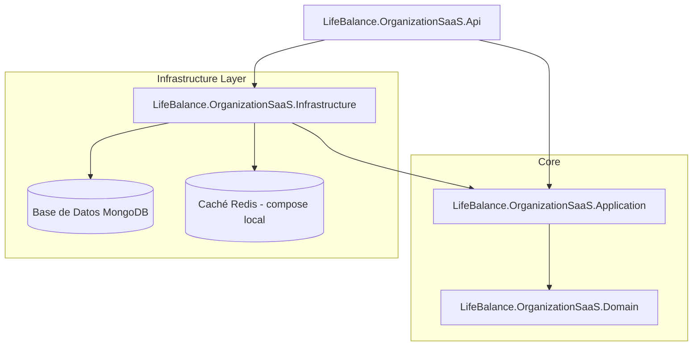

# LifeBalance - Microservicio de Organización y Servicio SaaS


El **Microservicio de Organización y Servicio SaaS** es el núcleo empresarial de la plataforma **LifeBalance**. Gestiona estructuras organizativas multi-inquilino (multi-tenant) como Empresas, Familias, Departamentos y Equipos, así como suscripciones SaaS, límites de planes, licencias, membresías, invitaciones y auditoría de cumplimiento.

> Más detalle en el [AGENTS.md](../AGENTS.md) del repositorio.

---

## 🏛 Arquitectura y Patrones de Diseño

El microservicio impone estrictamente **Clean Architecture**, **Domain-Driven Design (DDD)** y **CQRS**:



### Desglose de Capas
- `LifeBalance.OrganizationSaaS.Domain`: Aggregate Roots, Entidades (`Organization`, `Family`, `Department`, `Team`, `License`, `Subscription`, `Invitation`), Value Objects, Enums de Dominio, Excepciones de Dominio (`ResourceNotFoundException`, `ValidationException`, `ConflictException`, `UnauthorizedOperationException`, `LimitExceededException`) e interfaces de repositorio. Cero dependencias del framework.
- `LifeBalance.OrganizationSaaS.Application`: Manejadores CQRS (MediatR), DTOs, FluentValidation y comportamientos de pipeline (logging, validación multi-tenant).
- `LifeBalance.OrganizationSaaS.Infrastructure`: Contexto MongoDB y `MongoRepository<T>` genérico con **filtro de tenant incondicional**, `IGlobalTenantEntity` (exime a entidades globales como `SaaSPlan`) y `TenantContextAccessor`.
- `LifeBalance.OrganizationSaaS.Api`: Controladores RESTful v1, middleware de cabeceras de seguridad, Correlation ID, rate limiting, manejo global de excepciones (envelope `Response<T>`) y Swagger/OpenAPI.

---

## 🔐 Seguridad (remediaciones OWASP aplicadas)

1. **Fail-fast JWT:** si `JwtSettings__Secret` está vacío, es placeholder o mide <32 bytes UTF-8, **el servicio aborta el arranque** (`InvalidOperationException`). Issuer/Audience: `LifeBalance`, HS256, ClockSkew 1 min. En dev se usa `appsettings.Development.json` con un secreto propio.
2. **FallbackPolicy de autenticación:** **todo endpoint exige JWT válido** salvo `GET /health` y `POST api/v1/invitations/{token}/accept` | `reject`.
3. **NoSQL Injection:** prevenido con mapeo fuertemente tipado (`BsonElement`) y expresiones LINQ en `MongoRepository<T>`.
4. **Broken Access Control & IDOR:** filtro de tenant **incondicional** en todos los repositorios (ver resolución de tenant abajo) → fuga de datos entre inquilinos = imposible por construcción.
5. **Mass Assignment:** entidades de dominio aisladas de las peticiones HTTP mediante DTOs de comandos estrictos.
6. **Rate Limiting** por IP (`RemoteIpAddress`, ventana fija) → 429.
7. **Paginación clamp 1–100** y `Regex.Escape` en búsquedas.
8. **Security Headers:** `X-Content-Type-Options: nosniff`, `X-Frame-Options: DENY`, `Strict-Transport-Security`, `Content-Security-Policy`.
9. **Mensajes de error genéricos** al cliente; detalle solo en logs.

---

## 🏢 Modelo Multi-Tenant

El aislamiento se impone en la capa de persistencia: toda operación de base de datos añade automáticamente el `TenantId` actual a los filtros de consulta.

### Secuencia de Resolución de Contexto:
1. **Claim `tenant_id` del JWT** (prioridad).
2. **Header `X-Tenant-Id`** (petición HTTP).
3. Validación estricta: acceder a datos fuera del tenant asignado → `403 Forbidden`.

⚠️ *El orden fue invertido en la remediación de seguridad: antes el header tenía prioridad (podía suplantarse); ahora manda el claim del token.*

---

## 💎 Matriz de Planes SaaS

| Característica / Límite | Free | Personal | Family | Business | Enterprise |
| :--- | :---: | :---: | :---: | :---: | :---: |
| **Max Usuarios** | 5 | 1 | 6 | 250 | 10,000+ |
| **Max Familias** | 1 | 0 | 1 | 0 | 500 |
| **Max Empresas** | 1 | 0 | 0 | 1 | 50 |
| **Max Departamentos** | 2 | 0 | 0 | 20 | 200 |
| **Max Equipos** | 2 | 0 | 0 | 50 | 1,000 |
| **Retención de Datos** | 30 días | 90 días | 180 días | 365 días | Personalizado |
| **Dashboards y Reportes** | Básico | Básico | Familia | Completo | Personalizado |
| **AI Insights y Gamificación** | ❌ | ❌ | ✅ | ✅ | ✅ |
| **Acceso API** | ❌ | ❌ | ❌ | ✅ | ✅ |

### Licencias
La asignación de una licencia se valida contra `plan.Limits.MaxLicenses`: superar el límite → `LimitExceededException` (**409 Conflict**); plan inexistente → `ResourceNotFoundException` (**404**).

---

## 🔄 Matriz de Comunicación de Microservicios

El servicio se comunica con el resto del ecosistema mediante clientes HTTP tipados (`HttpClientFactory` + Polly) configurados en la sección `Microservices`:

| Microservicio Destino | Config | Propósito |
| :--- | :---: | :--- |
| **Auth & Profile Service** | `AuthProfileUrl` | Validación de usuario y perfiles |
| **Dashboard Service** | `DashboardUrl` | KPIs y métricas organizacionales |
| **Reporting Service** | `ReportingUrl` | Reportes de empresas, departamentos, suscripciones y licencias |
| **Notification Service** | `NotificationUrl` | Invitaciones y alertas de licencias |
| **Gamification Service** | `GamificationUrl` | Desafíos y clasificaciones |
| **ML Prediction Service** | `MlPredictionUrl` | Datos anonimizados para predicciones |
| **Administration Service** | `AdministrationUrl` | Parámetros globales y catálogos |

---

## 🚀 Referencia de Endpoints API REST

Todos requieren JWT (ver FallbackPolicy) salvo `accept`/`reject` de invitaciones.

### 1. Empresas (`/api/v1/organizations`)
- `POST /api/v1/organizations`: Registrar nueva empresa.
- `GET /api/v1/organizations`: Listar empresas (paginado y filtrado, clamp 1–100).
- `GET /api/v1/organizations/{id}`: Obtener detalles.
- `PUT /api/v1/organizations/{id}`: Actualizar.
- `DELETE /api/v1/organizations/{id}`: Eliminación lógica.
- `PATCH /api/v1/organizations/{id}/activate` | `/suspend` | `/restore`: Estados.
- `GET /api/v1/organizations/{id}/statistics`: Métricas.

#### Ejemplo de Petición: `POST /api/v1/organizations`
```json
{
  "name": "Acme Global Industries",
  "taxId": "ACM-990812-XX1",
  "planId": "PLAN_BUSINESS",
  "contactInfo": {
    "email": "contact@acme.com",
    "phone": "+1-555-0199",
    "contactPerson": "John Doe"
  },
  "address": {
    "street": "100 Innovation Way",
    "city": "Austin",
    "state": "Texas",
    "country": "USA",
    "zipCode": "78701"
  }
}
```

#### Ejemplo de Respuesta: `201 Created` (envelope `Response<T>`)
```json
{
  "success": true,
  "message": "Organization created successfully.",
  "data": {
    "id": "66a81f2b4c10a80012345678",
    "tenantId": "TENANT_ACME_001",
    "name": "Acme Global Industries",
    "taxId": "ACM-990812-XX1",
    "status": "Active",
    "planId": "PLAN_BUSINESS",
    "createdAt": "2026-07-29T16:00:00Z",
    "updatedAt": null
  },
  "errors": []
}
```

### 2. Familias (`/api/v1/families`)
- `POST /` | `GET /` | `GET /{id}` | `PUT /{id}` | `DELETE /{id}` (disolver)
- `POST /{id}/members` · `DELETE /{id}/members/{userId}` · `PATCH /{id}/administrator`

### 3. Departamentos y Equipos
- `/api/v1/departments`: `POST /` | `GET /` | `GET /{id}` | `PUT /{id}` | `DELETE /{id}` | `POST /{id}/members` | `DELETE /{id}/members/{userId}`
- `/api/v1/teams`: idéntico a departamentos.

### 4. Licencias, Suscripciones e Invitaciones
- `/api/v1/licenses`: `POST /` | `GET /` | `GET /{id}` | `DELETE /{id}` | `POST /{id}/assign` | `POST /{id}/cancel` | `POST /{id}/renew` | `PATCH /{id}/change-plan` | `PATCH /{id}/renew`
- `/api/v1/subscriptions`: `POST /` | `GET /` | `PATCH /{id}/renew` | `PATCH /{id}/change-plan`
- `/api/v1/invitations`: `POST /` | `GET /` | `POST /{id}/resend` | `POST /{token}/accept` *(anónimo)* | `POST /{token}/reject` *(anónimo)*

---

## 🐳 Docker y Despliegue

### Ejecutar con Docker Compose
```bash
# Desde OrganizationAndSaaS/ — levanta API (8080:8080), MongoDB y Redis (loopback)
docker-compose -f docker/docker-compose.yml up -d --build
```

### Variables de Entorno
```env
# Usa el archivo docker/.env.example (NO commitees secretos reales)
ASPNETCORE_ENVIRONMENT=Production
ConnectionStrings__MongoDB=mongodb://mongo-db:27017
DatabaseSettings__DatabaseName=LifeBalance_OrganizationSaaS
JwtSettings__Secret=${JWT_SECRET}
Microservices__AuthProfileUrl=http://auth-profile-service:5001
Microservices__NotificationUrl=http://notification-service:5004
```

> ⚠️ **`JwtSettings__Secret` es obligatorio**: con valor vacío o placeholder el servicio no arranca (fail-fast). En Render la variable es `JwtSettings__Secret` y debe ser **idéntica al `Jwt__SecretKey`** de los otros 3 servicios. El antiguo secreto que figuraba en la documentación se consideró **comprometido** y fue removido del repositorio — genera uno nuevo con ≥32 bytes.

### Render
Configurado en `render.yaml` de la raíz como `lifebalance-organization-saas` (plan free, puerto 10000, health `GET /health`).

---

## 🧪 Testing

```bash
# Pruebas unitarias (~244 verdes)
dotnet test tests/LifeBalance.OrganizationSaaS.UnitTests/LifeBalance.OrganizationSaaS.UnitTests.csproj --configuration Release
```
