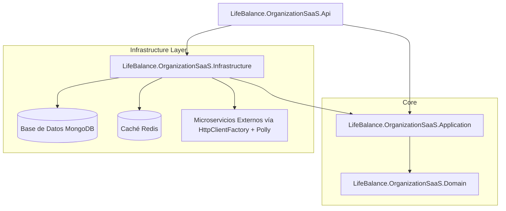

# LifeBalance - Microservicio de Organización y Servicio SaaS


El **Microservicio de Organización y Servicio SaaS** es el núcleo empresarial de la plataforma **LifeBalance**. Gestiona estructuras organizativas multi-inquilino (multi-tenant) como Empresas, Familias, Departamentos y Equipos, así como suscripciones SaaS, límites de planes, licencias, membresías, invitaciones y auditoría de cumplimiento.

---

## 🏛 Arquitectura y Patrones de Diseño

El microservicio impone estrictamente **Clean Architecture**, **Domain-Driven Design (DDD)**, y **CQRS (Command Query Responsibility Segregation)**:



### Desglose de Capas
- `LifeBalance.OrganizationSaaS.Domain`: Aggregate Roots, Entidades (`Organization`, `Family`, `Department`, `Team`, `License`, `Subscription`, `Invitation`, `AuditLog`), Value Objects, Enums de Dominio, Excepciones de Dominio e Interfaces de Repositorio. Cero dependencias del framework.
- `LifeBalance.OrganizationSaaS.Application`: Manejadores CQRS (MediatR), DTOs, Reglas de FluentValidation, Comportamientos de Pipeline (Logging, Validación Multi-Tenant, Validación de Request) e Interfaces de Microservicios.
- `LifeBalance.OrganizationSaaS.Infrastructure`: Contexto MongoDB y `MongoRepository<T>` genérico con inyección automática de filtro de Tenant, Clientes HTTP tipados con políticas de resiliencia **Polly** (Retry, Circuit Breaker), Caché Distribuido y Tenant Accessor.
- `LifeBalance.OrganizationSaaS.Api`: Controladores de API RESTful v1, Middleware de Cabeceras de Seguridad, Middleware de Correlation ID, Rate Limiting, Manejo de Excepciones (ProblemDetails RFC 7807) y Swagger/OpenAPI.

---

## 🏢 Modelo Multi-Tenant y Seguridad

El aislamiento se impone en la capa de persistencia utilizando un atributo obligatorio `TenantId`. Toda operación de base de datos añade automáticamente el `TenantId` actual a los filtros de consulta, previniendo la fuga de datos entre inquilinos (protección IDOR / Control de Acceso Roto).

### Secuencia de Resolución de Contexto:
1. Cabecera `X-Tenant-Id` (Petición HTTP).
2. Claim `tenant_id` del JWT.
3. Validación estricta: Si un usuario autenticado intenta solicitar datos fuera del `TenantId` asignado, se devuelve una respuesta `403 Forbidden`.

---

## 💎 Matriz de Planes SaaS

| Característica / Límite | Free | Personal | Family | Business | Enterprise |
| :--- | :---: | :---: | :---: | :---: | :---: |
| **Max Usuarios** | 5 | 1 | 6 | 250 | 10,000+ |
| **Max Familias** | 1 | 0 | 1 | 0 | 500 |
| **Max Empresas** | 1 | 0 | 0 | 1 | 50 |
| **Max Departamentos** | 2 | 0 | 0 | 20 | 200 |
| **Max Equipos** | 2 | 0 | 0 | 50 | 1,000 |
| **Retención de Datos** | 30 días | 90 días | 180 días | 365 días | Personalizado |
| **Dashboards y Reportes** | Básico | Básico | Familia | Completo | Personalizado |
| **AI Insights y Gamificación** | ❌ | ❌ | ✅ | ✅ | ✅ |
| **Acceso API** | ❌ | ❌ | ❌ | ✅ | ✅ |

---

## 🔄 Matriz de Comunicación de Microservicios

El **Microservicio de Organización y SaaS** se comunica con otros microservicios de la plataforma a través de Clientes HTTP resilientes (`HttpClientFactory` + Polly):

| Microservicio Destino | Dirección | Propósito / Responsabilidad |
| :--- | :---: | :--- |
| **Auth & Profile Service** | Salida | Validación de usuario, búsqueda de perfil, actualización de la referencia de organización del usuario. |
| **Dashboard Service** | Salida | Envío de KPIs organizacionales y métricas agregadas no biométricas. |
| **Reporting Service** | Salida | Envío de datos de catálogos de empresas, departamentos, suscripciones y licencias para reportes. |
| **Notification Service** | Salida | Envío de enlaces de invitación, alertas de caducidad de licencias y correos de cambio de membresía. |
| **Gamification Service** | Salida | Consulta de desafíos organizacionales y clasificaciones de familias. |
| **ML Prediction Service** | Salida | Envío de datos estructurales anonimizados para predicciones de modelos de Machine Learning. |
| **Administration Service** | Salida | Consulta de parámetros globales y catálogos del sistema. |

---

## 🚀 Referencia de Endpoints API REST

### 1. Empresas (`/api/v1/organizations`)
- `POST /api/v1/organizations`: Registrar nueva empresa.
- `GET /api/v1/organizations`: Listar empresas (Paginado y Filtrado).
- `GET /api/v1/organizations/{id}`: Obtener detalles de la empresa.
- `PUT /api/v1/organizations/{id}`: Actualizar información de la empresa.
- `DELETE /api/v1/organizations/{id}`: Eliminación lógica / suspender empresa.
- `PATCH /api/v1/organizations/{id}/activate`: Activar empresa.
- `PATCH /api/v1/organizations/{id}/suspend`: Suspender empresa.
- `PATCH /api/v1/organizations/{id}/restore`: Restaurar empresa.
- `GET /api/v1/organizations/{id}/statistics`: Obtener métricas de la empresa.

#### Ejemplo de Petición: `POST /api/v1/organizations`
```json
{
  "name": "Acme Global Industries",
  "taxId": "ACM-990812-XX1",
  "planId": "PLAN_BUSINESS",
  "contactInfo": {
    "email": "contact@acme.com",
    "phone": "+1-555-0199",
    "contactPerson": "John Doe"
  },
  "address": {
    "street": "100 Innovation Way",
    "city": "Austin",
    "state": "Texas",
    "country": "USA",
    "zipCode": "78701"
  }
}
```

#### Ejemplo de Respuesta: `201 Created`
```json
{
  "success": true,
  "message": "Organization created successfully.",
  "data": {
    "id": "66a81f2b4c10a80012345678",
    "tenantId": "TENANT_ACME_001",
    "name": "Acme Global Industries",
    "taxId": "ACM-990812-XX1",
    "status": "Active",
    "planId": "PLAN_BUSINESS",
    "subscriptionId": "",
    "configurationId": "",
    "contactInfo": {
      "email": "contact@acme.com",
      "phone": "+1-555-0199",
      "contactPerson": "John Doe"
    },
    "address": {
      "street": "100 Innovation Way",
      "city": "Austin",
      "state": "Texas",
      "country": "USA",
      "zipCode": "78701"
    },
    "createdAt": "2026-07-29T16:00:00Z",
    "updatedAt": null
  },
  "errors": []
}
```

### 2. Familias (`/api/v1/families`)
- `POST /api/v1/families`: Crear familia.
- `GET /api/v1/families`: Listar familias.
- `GET /api/v1/families/{id}`: Obtener familia por ID.
- `PUT /api/v1/families/{id}`: Actualizar familia.
- `DELETE /api/v1/families/{id}`: Disolver familia.
- `POST /api/v1/families/{id}/members`: Añadir miembro a la familia.
- `DELETE /api/v1/families/{id}/members/{userId}`: Eliminar miembro de la familia.
- `PATCH /api/v1/families/{id}/administrator`: Transferir administrador de la familia.

### 3. Departamentos y Equipos
- `POST /api/v1/departments` | `GET /api/v1/departments` | `PUT /api/v1/departments/{id}` | `DELETE /api/v1/departments/{id}`
- `POST /api/v1/teams` | `GET /api/v1/teams` | `PUT /api/v1/teams/{id}` | `DELETE /api/v1/teams/{id}`

### 4. Licencias, Suscripciones e Invitaciones
- `POST /api/v1/licenses` | `POST /api/v1/licenses/{id}/assign` | `POST /api/v1/licenses/{id}/renew`
- `POST /api/v1/subscriptions` | `PATCH /api/v1/subscriptions/{id}/renew` | `PATCH /api/v1/subscriptions/{id}/change-plan`
- `POST /api/v1/invitations` | `POST /api/v1/invitations/{token}/accept` | `POST /api/v1/invitations/{token}/reject`

---

## 🛡 Implementaciones de Seguridad OWASP

1. **NoSQL Injection**: Prevenido a través del mapeo fuertemente tipado `BsonElement` y expresiones LINQ en `MongoRepository<T>`.
2. **Broken Access Control & IDOR**: Estrictamente validado por `TenantContextAccessor` asegurando que el acceso a los recursos se mantenga dentro del `TenantId` de la petición.
3. **Mass Assignment**: Entidades de dominio aisladas de las peticiones HTTP utilizando DTOs de Comandos estrictos.
4. **Security Headers**:
   - `X-Content-Type-Options: nosniff`
   - `X-Frame-Options: DENY`
   - `Strict-Transport-Security: max-age=31536000; includeSubDomains`
   - `Content-Security-Policy: default-src 'self';`
5. **Rate Limiting**: Configurado a 100 peticiones / minuto por ventana fija usando `X-Tenant-Id` / IP.
6. **Correlation ID**: Middleware que propaga `X-Correlation-Id` a través de peticiones para rastreo distribuido.

---

## ⚡ Rendimiento y Resiliencia

- **Resiliencia con Polly**: Los clientes HTTP envuelven las peticiones salientes con **Exponential Backoff Retry** (3 intentos) y **Circuit Breaker** (5 errores consecutivos -> pausa de 30s).
- **Compresión de Respuesta**: Compresión Gzip y Brotli habilitada para salidas JSON de la API.
- **Caché Distribuida**: Integración IMemoryCache / Redis para los metadatos de los Planes SaaS y la configuración del Tenant.

---

## 🐳 Docker y Despliegue

### Ejecutar con Docker Compose
```bash
docker-compose -f docker/docker-compose.yml up -d --build
```

### Variables de Entorno (.env)
```env
ASPNETCORE_ENVIRONMENT=Production
ConnectionStrings__MongoDB=mongodb://mongo-db:27017
DatabaseSettings__DatabaseName=LifeBalance_OrganizationSaaS
JwtSettings__Secret=SuperSecretKeyForLifeBalanceSaaSMicroservice2026!
Microservices__AuthProfileUrl=http://auth-profile-service:5001
Microservices__NotificationUrl=http://notification-service:5004
```

---

## 🧪 Testing

Ejecutar las pruebas unitarias automatizadas:
```bash
dotnet test tests/LifeBalance.OrganizationSaaS.UnitTests/LifeBalance.OrganizationSaaS.UnitTests.csproj
```
